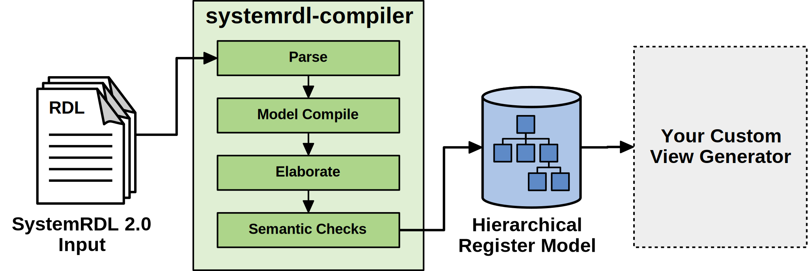

# SystemRDL Compiler

The `systemrdl-compiler` module implements a generic compiler front-end for
Accellera's [SystemRDL 2.0](http://accellera.org/downloads/standards/systemrdl)
register description language. The goal of this project is to provide a free and
open compiler that lowers the barrier to entry to using an industry standard
register description language.

By providing an elaborated register model that is easy to traverse and query,
it should be far easier to write custom register space view generators.

## Documentation
See the [SystemRDL Compiler Documentation](http://systemrdl-compiler.readthedocs.io) for more details
