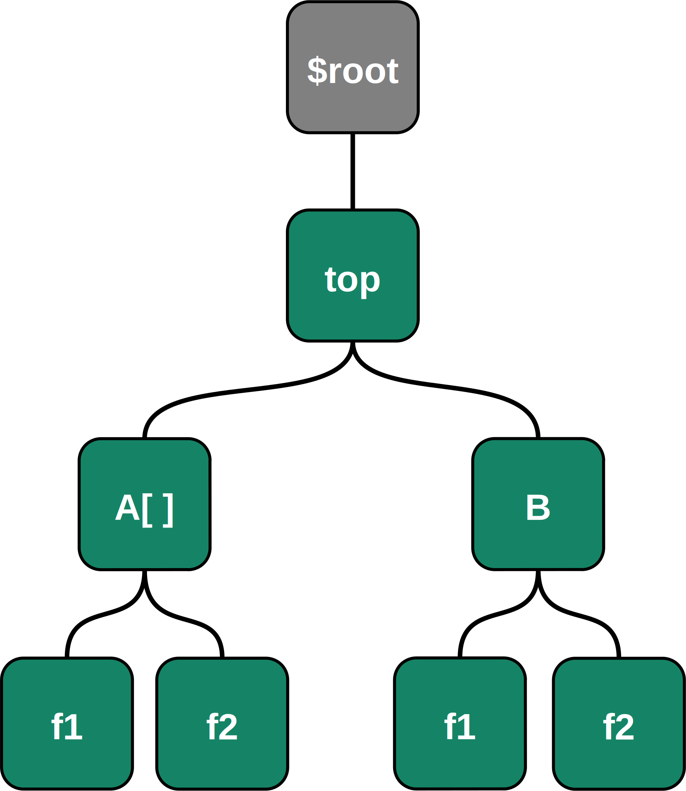
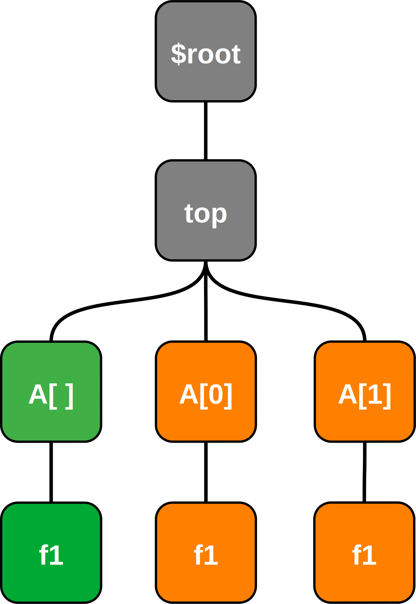

Register Model Structure
========================

Internal Representation
-----------------------
After compilation, the resulting register model is represented as a tree data structure.

Consider the following snippet of SystemRDL:

.. code-block:: systemrdl

    reg my_reg_t {
        field {} f1;
        field {} f2;
    };

    addrmap top {
        my_reg_t A[4];
        my_reg_t B;
    };

Once compiled, the resulting structure is as follows:

The resulting tree has the following characteristics:

-   Each RDL component instance is represented by a node in the tree.
-   Any instances within a component are represented as children of the
    component.
-   The ``$root`` meta-component contains an instance of the elaborated
    top-level addrmap, as well as any signals that were instantiated in the
    root namespace.
-   Internally, arrays of instances are represented as a single object that
    stores the array's dimensions.

Node Overlay
------------

The "Node" overlay is the user-facing data structure that provides an API for
design exploration and data extraction. All of your interactions with the
register model should be through :class:`~systemrdl.node.Node` objects.

When the you traverse the register model, :class:`~systemrdl.node.Node` objects
are dynamically created in order to provide unambiguous context as to which
instance is being represented. This is especially relevant when a design contains
arrays of instances.

Consider the instance ``A`` of ``my_reg_t`` in the example above. Since ``A`` is
instantiated as an array, it can be represented as two variants of a node as
shown in the example below:

Array node with undefined Index
    In the leftmost lineage (green), Node ``A[]`` is represented without a known
    array index. In this case, ``A[]`` represents the entire array.
    Since its index is not defined, the child ``A[].f1`` does not refer to a
    single specfic instance, but rather all the possible copies of ``f1``
    within the array ``A[]``.

    By default, node traversal methods use this representation of the design
    hierarchy.

Array node with a known Index
    On the right, nodes ``A[0]`` and ``A[1]`` (orange) represent distinct
    elements of the array.
    This representation is possible when unrolling child elements.

.. important::

    Beware when comparing nodes!

    Since Node objects are created dynamically during traversal, you cannot assume
    they are the same object.
    In order to check whether nodes represent the same hierarchy, nodes can be checked for equality using
    the ``==`` logical operator.

    .. code:: python

        child_x = node.get_child_by_name("B")
        child_y = node.get_child_by_name("B")

        assert child_x is child_y # FAILS
        assert id(child_x) == id(child_y) # FAILS
        assert child_x == child_y # passes
