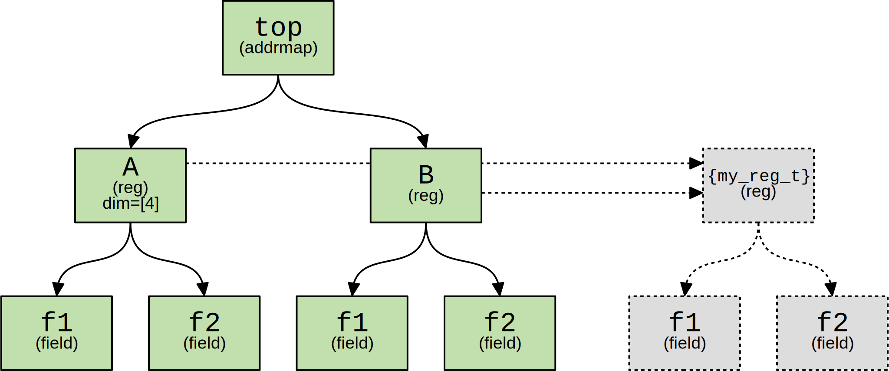
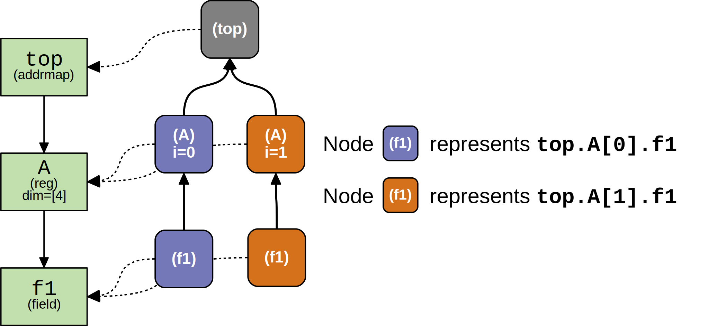

Register Model Structure
========================

Component Tree
--------------
After compilation, the resulting register model is modeled as an object tree.

Consider the following snippet of SystemRDL:

.. code-block:: systemrdl

    reg my_reg_t {
        field {} f1;
        field {} f2;
    };

    addrmap top {
        my_reg_t A[4];
        my_reg_t B;
    };

Once compiled, the resulting component tree is as follows:

The resulting tree has the following characteristics:

-   Each component instance is represented by a
    :class:`~systemrdl.component.Component` object.
-   Any instances within a component are referenced as children of the
    component.
-   The ``$root`` meta-component contains an instance of the elaborated
    top-level addrmap, as well as any signals that were instantiated in the
    root namespace.
-   All instances and their descendants are unique objects.
-   Arrays of instances are encoded as a single object that stores the array's
    dimensions.
-   Each instance in the component tree keeps a reference back to its original
    "as-defined" non-instance object.

    -   For example, instances ``A`` and ``B`` are both based off of the common
        component definition ``my_reg_t`` (shown in gray).
    -   Note that ``top`` and ``$root`` instances also have similar references,
        but are not shown in the diagram above.

Node Overlay
------------

The "Node" overlay is an additional data structure that is used to make model
traversal unambiguous.

Each :class:`~systemrdl.node.Node` object provides the following:

-   Reference to its corresponding :class:`~systemrdl.component.Component`
    instance.
-   Reference to its immediate parent
-   The current array index of an instance.
-   Helper functions that simplify querying and traversing the register model.

Most of the your interaction with the register model should be through
:class:`~systemrdl.node.Node` objects.

When the you traverse the register model, :class:`~systemrdl.node.Node` objects
are dynamically created in order to provide unambiguous context as to which
instance is being represented.

Consider the following lineage of instances from the previous example
``top -> A -> f1``. Note that register "A" is declared as an array of 4
instances.

Since the overlay provides references back up to each node's parent as well as
an array index, the unambiguous lineage can be known. (purple ``f1`` node vs
orange ``f1`` node)
