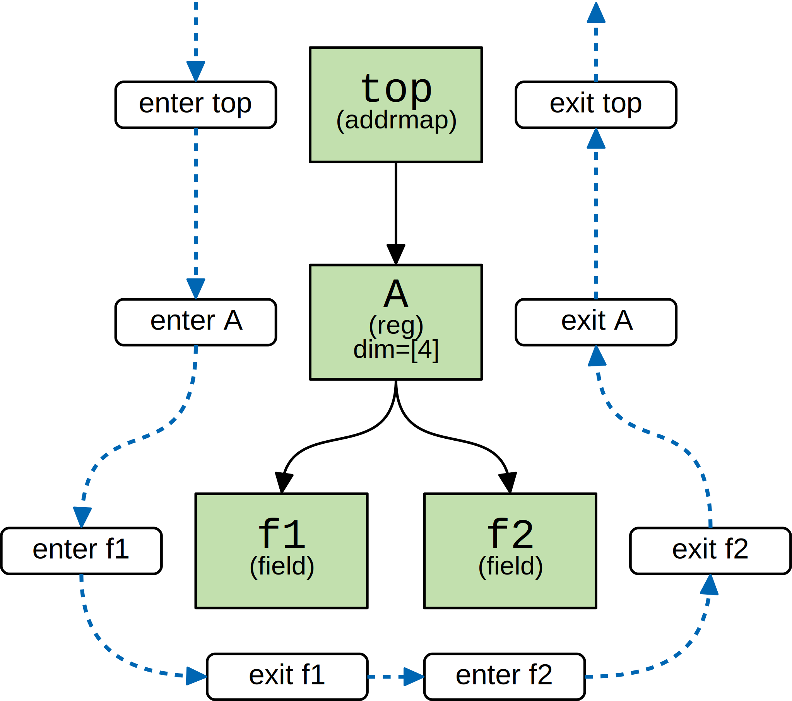

Traversing the Register Model
=============================

Using Iterators
---------------

Sometimes it is necessary to have more fine-grain control of how the register
model is explored. The :meth:`Node.children() <systemrdl.node.Node.children>`
method provides an iterator that can be used to manually traverse the tree.

.. code-block:: python

    top_node = root_node.get_child_by_name("top")

    for child in top_node.children(unroll=True):
        print(child.get_path())

The above outputs the following:

.. code-block:: none

    top.A[0]
    top.A[1]
    top.A[2]
    top.A[3]

The Node API also provides the :meth:`Node.descendants() <systemrdl.node.Node.descendants>`
recursive iterator.

.. code-block:: python

    top_node = root_node.get_child_by_name("top")

    for child in top_node.descendants():
        print(child.get_path())

The above outputs the following:

.. code-block:: none

    top.A
    top.A.f1
    top.A.f2

Using the Walker/Listener
-------------------------

One easy way to fully traverse a compiled register model is using a register-tree
listener interface, triggered by a :class:`~systemrdl.RDLWalker`.

The listener interface is a collection of callback methods contained in a class
extended from :class:`~systemrdl.RDLListener`. As the walker visits each
node, the type-specific callback method is triggered.

The built-in :class:`~systemrdl.RDLWalker` performs a depth-first walk
through the register model as shown in the diagram below:

.. note:: Since the :class:`~systemrdl.node.RootNode` does not actually
        represent a register model component, the :class:`~systemrdl.RDLWalker`
        intentionally skips it during traversal.

To create a listener, extend :class:`~systemrdl.RDLListener` and implement
your custom callback methods. In the example below, ``MyListener`` prints a
message each time the walker enters and exits type-specific nodes:

.. code-block:: python

    from systemrdl import RDLListener, RDLWalker

    class MyListener(RDLListener):
        def enter_Addrmap(self, node):
            print("Entering addrmap", node.get_path())

        def exit_Addrmap(self, node):
            print("Exiting addrmap", node.get_path())

        def enter_Reg(self, node):
            print("Entering register", node.get_path())

        def exit_Reg(self, node):
            print("Exiting register", node.get_path())

        def enter_Field(self, node):
            print("Entering field", node.get_path())

        def exit_Field(self, node):
            print("Exiting field", node.get_path())

Next, the walker can be started using an instance of
:class:`~systemrdl.RDLWalker`. In this example, the input ``root_node`` is
assumed to represent the top-level addrmap component called "top".

.. code-block:: python

    RDLWalker().walk(root_node, MyListener())

Results in the following output:

.. code-block:: none

    Entering addrmap top
    Entering register top.A[]
    Entering field top.A[].f1
    Exiting field top.A[].f1
    Entering field top.A[].f2
    Exiting field top.A[].f2
    Exiting register top.A[]
    Exiting addrmap top

To unroll all arrays during traversal, create a walker with loop unrolling
enabled:

.. code-block:: python

    RDLWalker(unroll=True).walk(root_node, MyListener())

.. code-block:: none

    Entering addrmap top
    Entering register top.A[0]
    Entering field top.A[0].f1
    Exiting field top.A[0].f1
    Entering field top.A[0].f2
    Exiting field top.A[0].f2
    Exiting register top.A[0]
    Entering register top.A[1]
    Entering field top.A[1].f1
    Exiting field top.A[1].f1
    Entering field top.A[1].f2
    Exiting field top.A[1].f2
    Exiting register top.A[1]

    ... etc ...

    Exiting register top.A[3]
    Exiting addrmap top

Other Methods
-------------

Node objects provide several other mechanisms to traverse the register model.
This is not an exhaustive list, but highlights some of the more commonly used ones.
See the class reference for more details.

Iterators
    * :meth:`systemrdl.node.Node.children()`
    * :meth:`systemrdl.node.Node.descendants()`
    * :meth:`systemrdl.node.Node.unrolled()`

Explicit navigation
    * :meth:`systemrdl.node.Node.get_child_by_name()`
    * :meth:`systemrdl.node.Node.find_by_path()`
